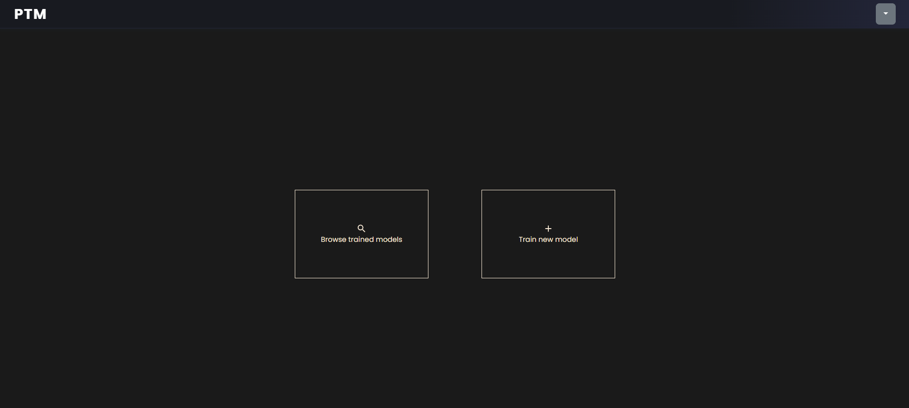
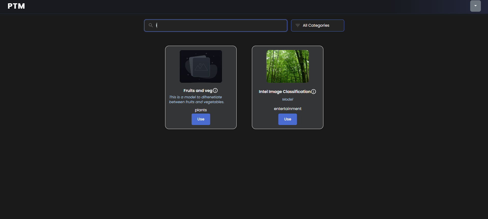
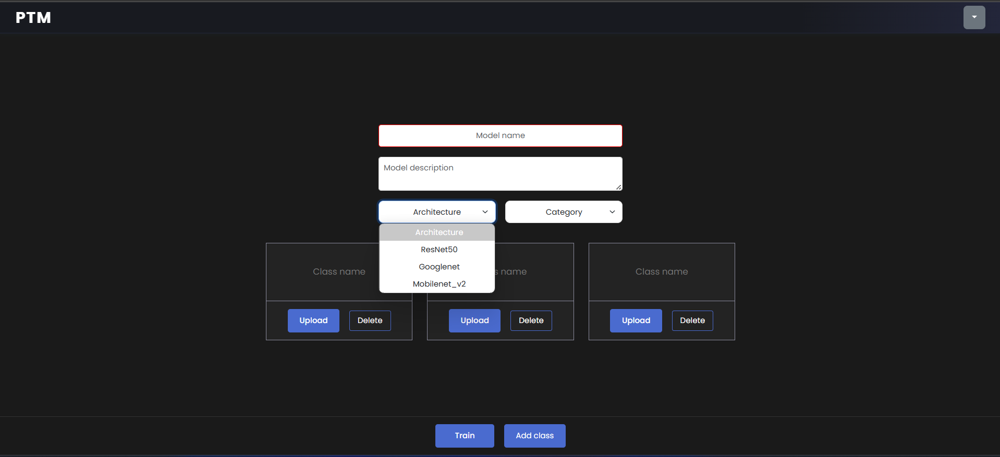
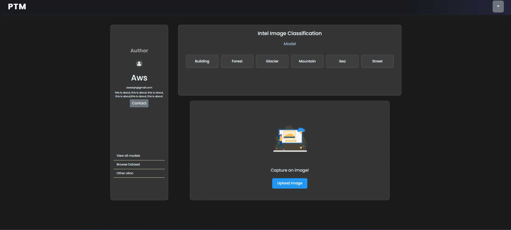
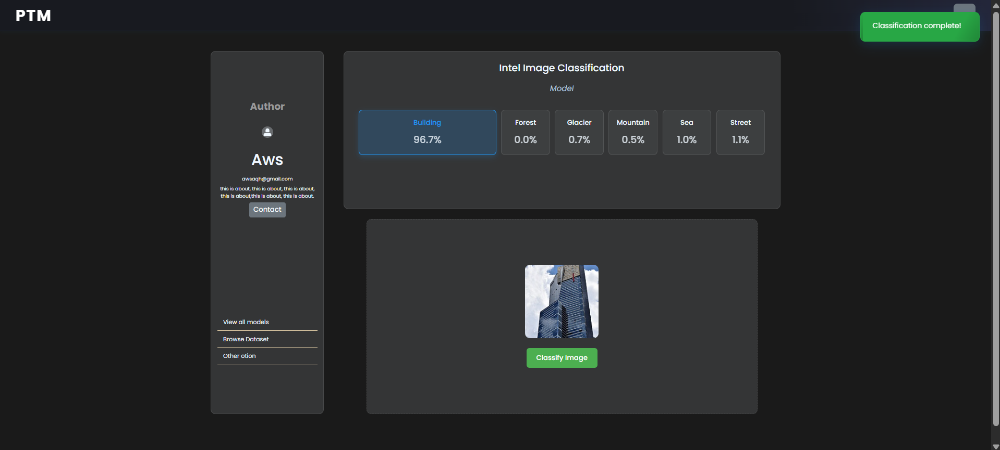
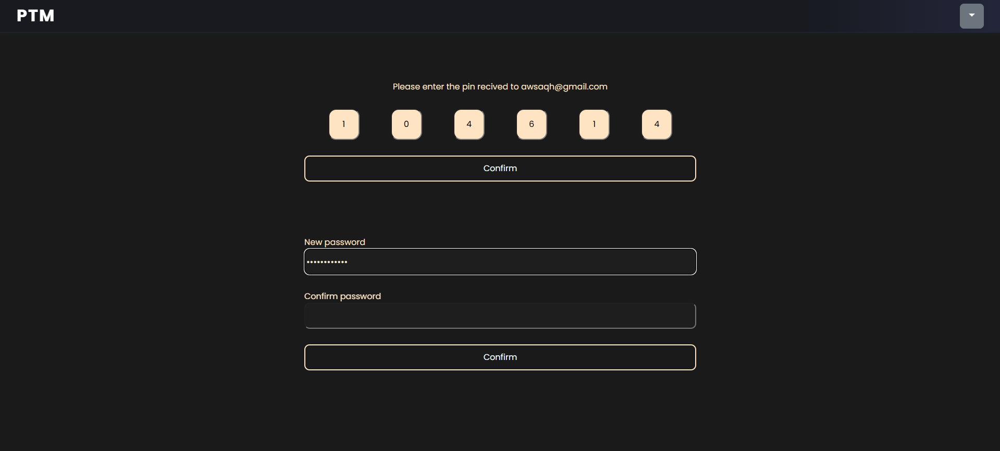

# Portable Teachable Machine: Cloud-Based Image Classification Platform

---

## Local Development & Project Preview

This project is designed for **local development**. All services (frontend, backend, and training server) run on your machine. You will need local instances of MongoDB, Node.js, Python, and the required cloud credentials.

**Quickstart Overview:**
1. Clone the repo and install dependencies.
2. Set up MongoDB locally and configure the connection string.
3. Set up Cloudinary (for image storage) and Google Cloud Storage (for model storage).
4. Create required folders (notably `pytorch/models`).
5. Set environment variables in `.env` files for each service.
6. Start backend, frontend, and PyTorch server.
7. Use the web interface to upload datasets, train models, and classify images.

---

## Mobile App

A companion **mobile app** is available for on-the-go data collection and model training. You can find the mobile app repository here:

- [PTM Mobile App Repository](https://github.com/awsaqh/ptm-mobile)  


The mobile app allows you to capture images and interact with your PTM backend from your phone or tablet.

---

## Features

- **User-friendly web interface** for dataset upload, model training, and image classification.

- **Transfer learning** with popular architectures (ResNet50, GoogLeNet, MobileNetV2).

- **Cloudinary** for dataset storage and serving.

- **Google Cloud Storage** for model storage.

- **Automatic data augmentation** for robust training.

- **Confidence-based "other/uncertain" detection** for out-of-distribution images.

- **Per-class accuracy reporting** and training progress feedback.

- **JWT-based authentication** and user management.

- **Modern React frontend** and RESTful Node.js/Express backend.

- **Python (PyTorch) training and inference server**.

---

## Tech Stack

- **Frontend:** React, CSS

- **Backend:** Node.js, Express, MongoDB, Mongoose

- **ML/Training:** Python, PyTorch, torchvision

- **Cloud Storage:** Cloudinary (images), Google Cloud Storage (models)

- **Authentication:** JWT

---

## Setup Instructions

### 1. Clone the Repository

```bash
git clone https://github.com/awsaqh/ptm.git
cd ptm
```

### 2. Backend Setup

```bash
cd backend
npm install
# Set up your .env file with Cloudinary and JWT secrets
node app.js
```

#### Backend .env Example
Create a `backend/.env` file with the following:
```
CloudName=your_cloudinary_cloud_name
ApiKey=your_cloudinary_api_key
ApiSecret=your_cloudinary_api_secret
JWT_SECRET=your_jwt_secret
```
**Note:** The MongoDB connection string is hardcoded as `mongodb://localhost:27017/ptm-local` in `backend/app.js`. There is no need to set it in the .env file, just modify it as what is your connection string.

### 3. Frontend Setup

```bash
cd ..
npm install
# Set up your .env file with API URLs
npm run dev
```

### 4. Python Training Server

```bash
cd ../pytorch
pip install -r requirements.txt
# Set up your .env file with Cloudinary and GCP credentials
python server.py
```

#### PyTorch Server .env Example
Create a `pytorch/.env` file with the following:
```
CloudName=your_cloudinary_cloud_name
ApiKey=your_cloudinary_api_key
ApiSecret=your_cloudinary_api_secret
GOOGLE_APPLICATION_CREDENTIALS=secrets/gcs-key.json
GCP_KEY_JSON=your_gcp_key_json_contents   # (optional, for Render.com or similar)
```

---

## Cloud Storage & API Key Setup

### MongoDB (Local Database)
- Install MongoDB locally and ensure it is running.
- The backend connects to MongoDB using the hardcoded URI `mongodb://localhost:27017/ptm-local` in `backend/app.js`.
- **No need to set the MongoDB connection string in the .env file.**

### Google Cloud Storage (GCS) for Model Storage

1. **Create a GCS Bucket:**

   - Go to the [Google Cloud Console](https://console.cloud.google.com/).

   - Create a new bucket (e.g., `ptm_models`).

   - Update the bucket name in `pytorch/train_model.py` if you use a different name.

2. **Service Account & Credentials:**

   - Go to IAM & Admin > Service Accounts.

   - Create a new service account with roles:

     - Storage Object Viewer

     - Storage Object Creator

   - Create a new key (JSON format) and download it.

   - Place the file as `pytorch/secrets/gcs-key.json`.

3. **.env Setup for PyTorch Server:**

   - In `pytorch/.env`, add:

     ```
     GOOGLE_APPLICATION_CREDENTIALS=secrets/gcs-key.json
     ```

   - The code will automatically use this file for GCS access.

4. **Required Folders:**

   - Ensure `pytorch/models/` exists for local model storage. The code will create it if missing.

### Cloudinary for Dataset Storage

1. **Create a Cloudinary Account:**

   - [Sign up here](https://cloudinary.com/).

   - Get your Cloud Name, API Key, and API Secret from the dashboard.

2. **.env Setup for Backend:**

   - In `backend/.env`, add:

     ```
     CloudName=your_cloudinary_cloud_name
     ApiKey=your_cloudinary_api_key
     ApiSecret=your_cloudinary_api_secret
     ```

### Security & Best Practices

- **Never commit sensitive files** like `.env` or `gcs-key.json` to version control. Add these to your `.gitignore`:

  ```
  # .gitignore
  .env
  secrets/gcs-key.json
  pytorch/models/*
  !pytorch/models/.gitkeep
  ```

- For production, use environment variables for all secrets.

- For Render.com or similar, set `GCP_KEY_JSON` as an environment variable (the code will write it to `gcs-key.json` automatically).

### Summary of Required Files & Folders

- `pytorch/.env` (with GCS and Cloudinary credentials)

- `pytorch/secrets/gcs-key.json` (GCS service account key)

- `pytorch/models/` (**must exist** for local model storage)

- `backend/.env` (with Cloudinary, MongoDB, and JWT credentials)

---

## Folder Structure

```
ptm/
├── backend/
│   ├── .env
│   └── ...
├── pytorch/
│   ├── .env
│   ├── secrets/
│   │   └── gcs-key.json
│   ├── models/   # <--- Models are saved here locally
│   └── ...
├── src/ (frontend)
├── screenshots/
└── ...
```

---

## How Model Saving Works
- **During training**, models are always saved locally to `pytorch/models/`.
- If Google Cloud credentials are provided, the model is also uploaded to your GCS bucket.
- The GCS bucket and credentials are set in `pytorch/secrets/gcs-key.json` and referenced in `.env`.
- If the GCS secret file is missing, models are only saved locally.

---

## Usage

1. **Register/Login** on the web interface.

2. **Upload your dataset** (images organized by class).

3. **Train a new model** by selecting architecture and classes.

4. **Classify images** using your trained model.

5. **View model performance** and per-class accuracy.

---

## Handling Out-of-Distribution Images

- The system uses a confidence threshold (default: 58%) to flag predictions as "other/uncertain" if the model is not confident.

- This helps prevent misleading results when users upload images unrelated to the trained classes.

---

## Screenshots

### Home



### Browse Models



### Train New Model



### Classify Image



### Classification Result



### Reset Password



---

## Contributing

Pull requests are welcome! For major changes, please open an issue first to discuss what you would like to change.

---

## License

[MIT](LICENSE) 